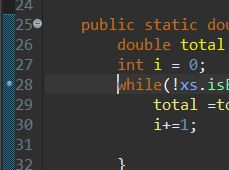
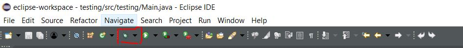
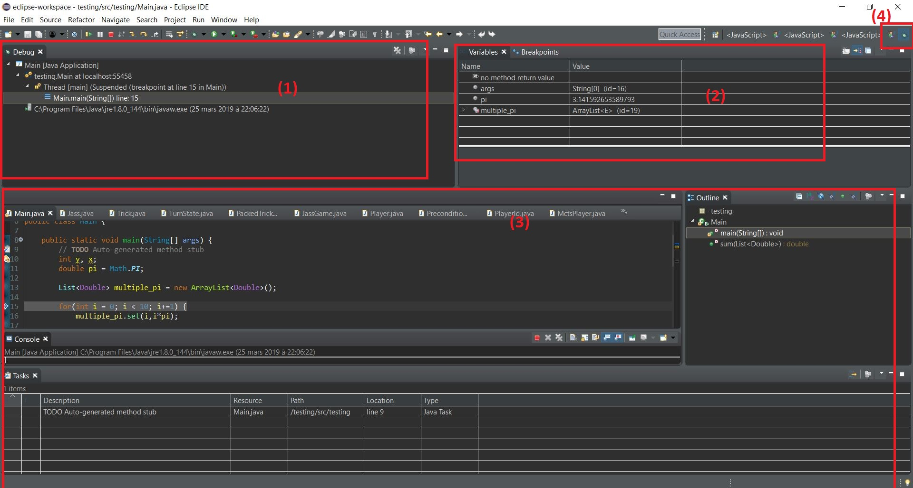
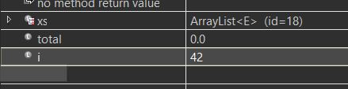
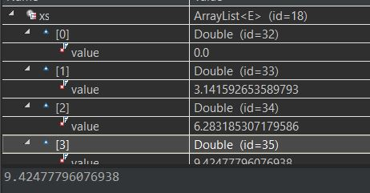
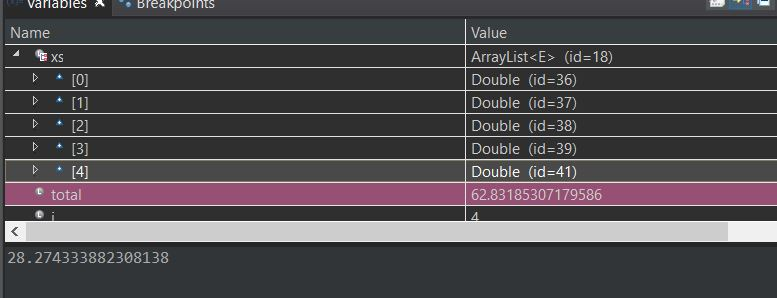

<h1> Guide pratique pour débogage en Java </h1>

<h2> Notes </h2>
<p>
Ce tutoriel s'adresse aux personnes qui ont besoin d'une mise à jour concernant l'utilisation du débogueur en Java. <br>
On assume ici que le lecteur est familier avec Java et utilise Eclipse comme IDE. <br>
Ce guide n'est pas exhaustif loin de là, si vous avez des questions supplémentaires
<a href="https://stackoverflow.com/questions/tagged/debugging+java">stackoverflow</a>
est un excellent point de départ. <br>
Pour tous les détails la <a href="https://docs.oracle.com/cd/E24382_01/user.1112/e17455/run_debug_java.htm#OJDUG2059">Javadoc</a> est très complète mais plus compliquée à naviguer.<br>


</p>

<h2> Débuguer un programme </h2>

<p>
Quand on lance un programme pour la première fois, il est rare que le résultat soit correct. C'est pourquoi il est intéressant de comprendre comment le débogueur fonctionne.
</p>
<h2> Programme de base </h2>
<p>
Supposons un programme basique
</p>

```java
package testing;

import java.util.ArrayList;
import java.util.List;

public class Main {

	public static void main(String[] args) {
		int y, x;
		double pi = Math.PI;
		List<Double> multiple_pi = new ArrayList<Double>();

		for(int i = 0; i < 10; i ++) {
			multiple_pi.add(i*pi);
		}
		System.out.println("Total is "+sum(multiple_pi));
	}

	public static double sum(List<Double> xs) {
		double total = 0;
		int i = 0;
		while(!xs.isEmpty()) {
			total =total + xs.remove(i);
			i+=1;
		}
		return total;
	}
}
```

<p>
Ou l'on veut faire une liste et ensuite calculer la somme.
quand on l'exécute on obtient ceci :
</p>

```
Exception in thread "main" java.lang.IndexOutOfBoundsException: Index: 5, Size: 5
	at java.util.ArrayList.rangeCheck(Unknown Source)
	at java.util.ArrayList.remove(Unknown Source)
	at testing.Main.sum(Main.java:24)
	at testing.Main.main(Main.java:17)

```
On pourrait bien sur commencer à mettre des `System.out.println("bla");` partout mais ce n'est pas pratique. Il faudra se rappeler de les supprimer et aussi quand c'est un grand projet ça devient difficile.

<h2> Mettre un breakpoint </h2>
<p>
Le débogueur permet de stopper le programme a un moment qui nous intéresse afin d'analyser le code.
Avant de commencer il faut mettre un `breakpoint` afin de dire au programme quand on veut qu'il lance le débogueur.
Pour ce faire, il faut aller sur la ligne ou l'on veut mettre le breakpoint, et faire un double clic. Vous devriez voir une bulle bleue apparaître. Ici nous le mettons à la ligne 28 car c'est où nous avons l'erreur.
</p>

<br><br>
Maintenant que le breakpoint est mis en place, nous pouvons le lancer. Il suffit de cliquer sur l'icône avec un insecte dessus. (D'où le de**bug**gueur)<br><br>
<br>
<h2>Vue sur le débogueur</h2>
<p>Une fois que nous avons cliqué sur l'icône la vue débug s'ouvre.</p>



<p>

<ol>
<li> La vue sur les threads les programmes qui sont en trains d'être exécuter</li>
<li>La vue sur les variables du programme on peut voir les variables du programme comme `pi,multiple_pi`</li>

<li>La vue sur le programme en train d'être exécuter. Notez la ligne qui est mise en évidence est celle où nous avons mis un breakpoint auparavant.</li>
<li>Deux icônes. Pour retourner sur la vue précédente cliquez sur celui qui correspond à `Java` </li>
</ol>

Notez que si certains éléments vous manquent, vous pouvez les afficher en faisant `Window > Show View` et sélectionnez ce que vous voulez voir.
</p>
<h2> Exécuter le programme </h2>


<p>
Nous avons ici les boutons disponibles pour exécuter le programme dans le débuguer. Détaillons-les de gauche à droite
<ol>
<li>Résume l'exécution du programme jusqu'à la fin ou au prochain breakpoint</li>
<li>Suspend le programme (pratique dans les boucles infinies...)</li>
<li>Stop le programme</li>
<li>Disconnect (Je ne l'ai personnellement jamais utilisé)</li>
<li>Step into : exécute la prochaine instruction et si possible entre dans la fonction qui va être exécuter</li>
<li>Step over : exécute la prochaine instruction et n'entre pas dans les sous-routines</li>
<li>Step return - résume l'exécution du programme jusqu'au prochain `return`</li>
</ol>

Nous pouvons donc exécuter le programme étape par étape et voir ce qui est faux.
</p>

<h2> Déroulement </h2>
<p>
On commence dont à `Step over`. En regardant la vue sur les `Variables` on voit que les éléments sont mis à jour correctement. Il est même possible de les éditer soi-même pour voir si certaines valeurs fonctionnes.
Par exemple, on pourrait vouloir voir comment le programme réagit quand `i=42`</p>



<br>
<p>
Ou encore regarder ce qu'il y a dans la liste `xs`. En parlant de la liste `xs`, observons comment elle se comporte au fur et à mesure de l'exécution du programme.</p>



<p>
Il s'avère que quand on enlève un élément avec `xs.remove(i)` la liste décale les éléments, ainsi on avait un index out of bound car quand on enlevait les éléments il n'y en avait plus assez !
</p>



<p>C'est un peu plus pratique que de devoir lire des trentaines de lignes dans un terminal.</p>


<h2> Réparation du programme </h2>

En réparant le programme on a l'output attendu.

```java
public static double sum(List<Double> xs) {
  double total = 0;
  int i = 0;
  while(!xs.isEmpty()) {
    total =total + xs.get(i);
    i+=1;
  }
  return total;
}
```

```
Total is 141.3716694115407
```

<h2>Conclusion </h2>
Ici je présente uniquement les idées de bases du débogueur, si le temps me le permet j'ajouterai des astuces supplémentaires. <br>
Ces bases sont suffisantes pour comprendre comment utiliser le débogueur de manière rudimentaire pour comprendre comment ce que votre programme fait (ou plutôt ne fait pas).
